# CSE 576 Homework 1 (Python) #

Welcome. For the first assignment, you'll get familiar with the codebase and practice image manipulation in Python.

You should modify:

    src/hw1/process_image.py

After each change, run tests:

    python -m src.main test hw1

If you run the above code without making any changes to the original repo, you will get the following result:

    17 tests, 3 passed, 14 failed

Once everything is implemented correctly, you will get:

    17 tests, 17 passed, 0 failed

You can also run the demo script to generate output images:

    python tryhw1.py

### Image basics ###

In Python, images are represented by `uwimg.Image` (a dataclass). Key fields are:

- `im.w`: width
- `im.h`: height
- `im.c`: number of channels
- `im.data`: pixel data as a float array in `CHW` layout (`(c, h, w)`), values in `[0, 1]`

Useful helpers from `uwimg.py`:

    from uwimg import load_image, save_image, make_image

Load an image:

    im = load_image("image.jpg")

Save an image (saved as `.jpg`):

    save_image(im, "output")

Create a blank image of size `w x h x c`:

    im = make_image(w, h, c)

Unlike C, you generally do not need manual memory cleanup in this assignment.

## 1. Getting and setting pixels ##

The most basic operation we want to do is change the pixels in an image. As we talked about in class, we represent an image as a 3 dimensional tensor. We have spatial information as well as 3 channels (red, green and blue) which combine together to form a color image:

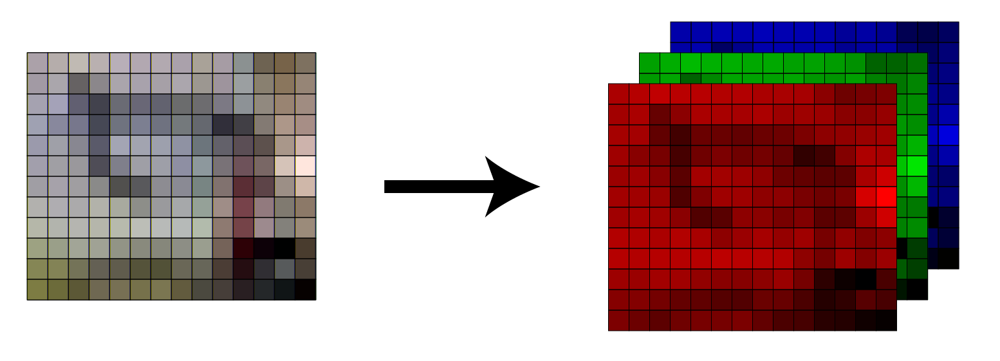

The convention is that the coordinate system starts at the top left of the image, like so:

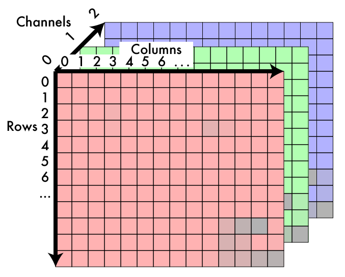

In our `data` array we store the image in `CHW` format. The first pixel in data is at channel 0, row 0, column 0. The next pixel is channel 0, row 0, column 1, then channel 0, row 0, column 2, etc.

#### TO DO ####
Fill in these functions in `process_image.py`:

    def get_pixel(im: Image, x: int, y: int, c: int) -> float:
    def set_pixel(im: Image, x: int, y: int, c: int, v: float) -> None:

- `get_pixel`: return value at column `x`, row `y`, channel `c`
- `set_pixel`: set that value to `v`

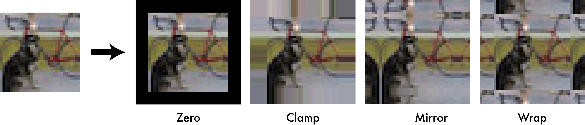

We will use the `clamp` padding strategy. This means that if the programmer asks for a pixel at column -3, use column 0, or if they ask for column 300 and the image is only 256x256 you will use column 255 (because of zero-based indexing).

You can test by removing red from the dog image (`tryhw1.py`):

    im = load_image("data/dog.jpg")
    for row in range(im.h):
        for col in range(im.w):
            set_pixel(im, col, row, 0, 0)
    save_image(im, "dog_no_red")

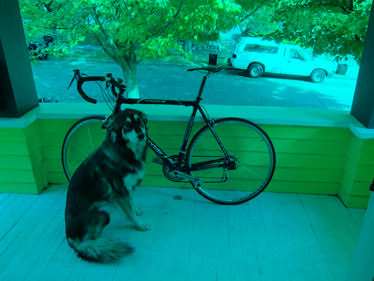

## 2. Copying images ##

Implement:

    def copy_image(im: Image) -> Image:

Return a deep copy with identical shape and pixel values.

## 3. Grayscale image ##

Now let's start messing with some images! We will first convert color images to grayscale. Here's a colorbar we may want to convert:

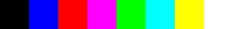

If we convert it using an equally weighted mean Y = (R+G+B)/3 we get a conversion that doesn't match our perceptions of the given colors:

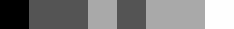

Instead we are going to use a weighted sum. Now, there are a few ways to do this. Video engineers use a calculation called [luma][2] to find an approximation of perceptual intensity when encoding video signal, so we'll use that to convert our image to grayscale. We simply perform a weighted sum:

    Y = 0.299 R + 0.587 G + .114 B

    def rgb_to_grayscale(im: Image) -> Image:

Example in `tryhw1.py`:

    im = load_image("data/colorbar.png")
    graybar = rgb_to_grayscale(im)
    save_image(graybar, "graybar")

## 4. Shifting image colors ##

Implement:

    def shift_image(im: Image, c: int, v: float) -> None:

Add `v` to every pixel in channel `c` (in place).

You can test with:

    im = load_image("data/dog.jpg")
    shift_image(im, 0, .4)
    shift_image(im, 1, .4)
    shift_image(im, 2, .4)
    save_image(im, "overflow")

If values exceed 1, saved output can show artifacts:

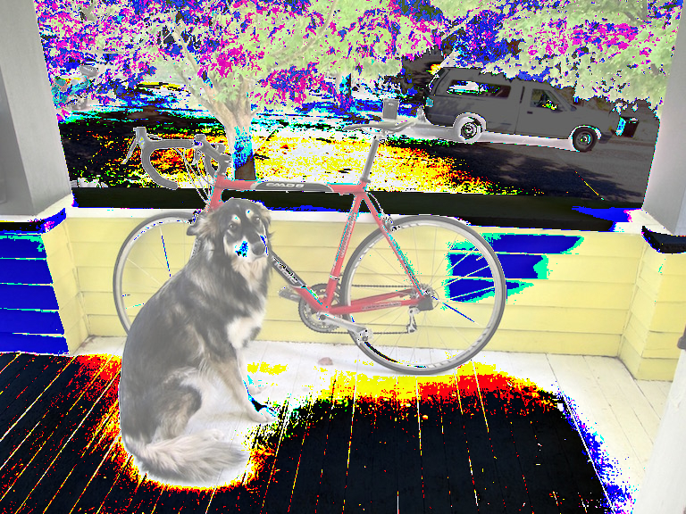

## 5. Clamping image values ##

Keep all pixels in `[0, 1]`:

    def clamp_image(im: Image) -> None:

If a value is below `0`, set to `0`; above `1`, set to `1`.

After clamping and saving:

    clamp_image(im)
    save_image(im, "doglight_fixed")

the result should look like:

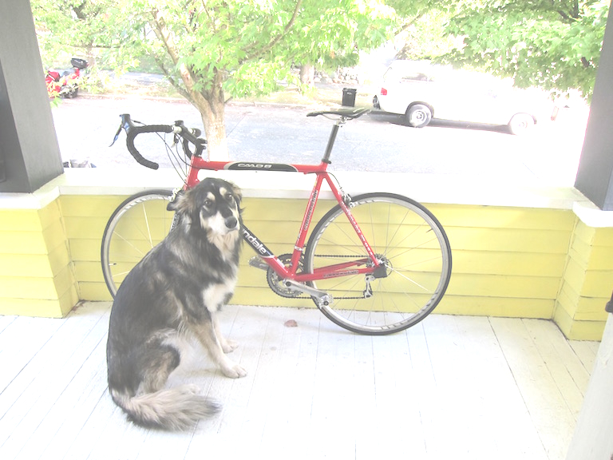

## 6. RGB to HSV ##

We convert from RGB cube space to HSV cylinder space:

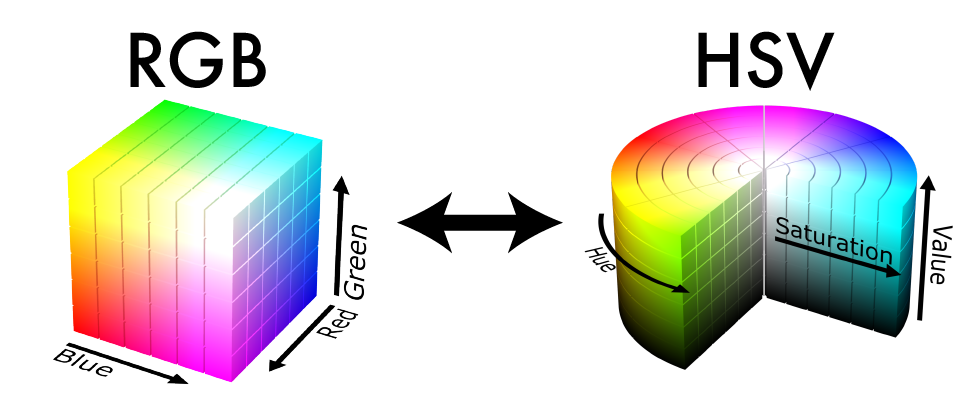

[Hue](https://en.wikipedia.org/wiki/Hue) can be thought of as the base color of a pixel. [Saturation](https://en.wikipedia.org/wiki/Colorfulness#Saturation) is the intensity of the color compared to white (the least saturated color). The [Value](https://en.wikipedia.org/wiki/Lightness) is the perception of brightness of a pixel compared to black. You can try out this [demo](http://math.hws.edu/graphicsbook/demos/c2/rgb-hsv.html) to get a better feel for the differences between these two colorspaces. For a geometric interpretation of what this transformation:

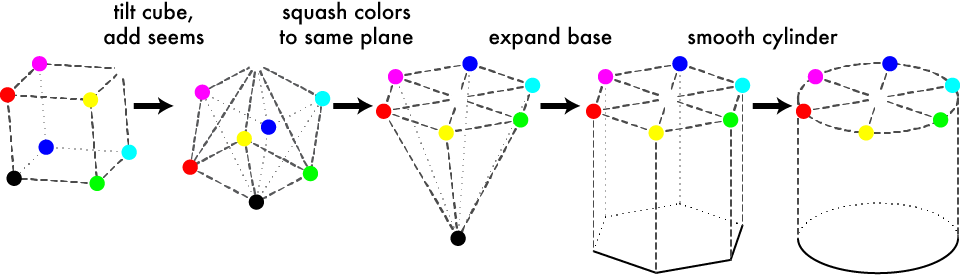

The easiest component to calculate is the Value, it's just the largest of the 3 RGB components:

    V = max(R,G,B)

Next we calculate Saturation. This is a measure of how much color is in the pixel compared to neutral white/gray. Neutral colors have the same amount of each three color components, so to calculate saturation we see how far the color is from being even across each component. First we find the minimum value

    m = min(R,G,B)

Then we see how far apart the min and max are:

    C = V - m

and the Saturation will be the ratio between the difference and how large the max is:

    S = C / V

Except if R, G and B are all 0. Because then V would be 0 and we don't want to divide by that, so just set the saturation 0 in that case.

Finally, to calculate Hue we want to calculate how far around the color hexagon our target color is.

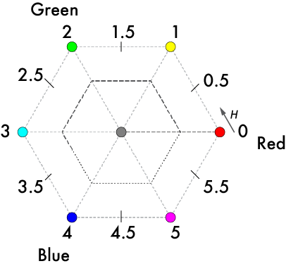

We start counting at Red. Each step to a point on the hexagon counts as 1 unit distance. The distance between points is given by the relative ratios of the secondary colors. We can use the following formula from [Wikipedia](https://en.wikipedia.org/wiki/HSL_and_HSV#Hue_and_chroma):

Implement in-place conversion:

    def rgb_to_hsv(im: Image) -> None:

Store results back into the same image as:

- channel 0 = `H`
- channel 1 = `S`
- channel 2 = `V`

Use:

    V = max(R,G,B)
    m = min(R,G,B)
    C = V - m
    S = C / V   (if V == 0, use S = 0)

If `C == 0`, set `H = 0`. Keep `H` in `[0,1)` (wrap if needed).

Reference hue equation:

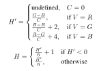

## 7. HSV to RGB ##

Implement the inverse conversion in place:

    def hsv_to_rgb(im: Image) -> None:

Reference formulas:

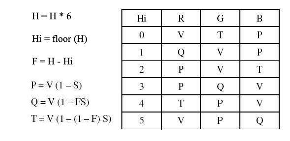

Then try the saturation demo in `tryhw1.py`:

    im = load_image("data/dog.jpg")
    rgb_to_hsv(im)
    shift_image(im, 1, .2)
    clamp_image(im)
    hsv_to_rgb(im)
    save_image(im, "dog_saturated")

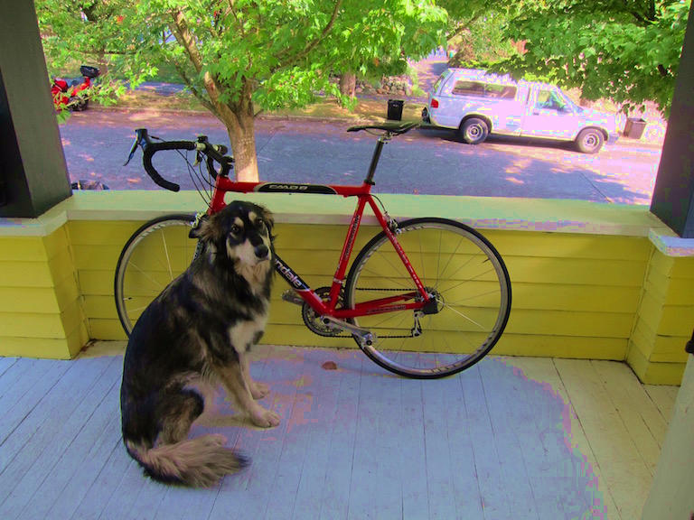

That's exciting! You may play around with it a little bit to see what you can make. Note that with the above method we do get some artifacts because we are trying to increase the saturation in areas that have very little color. Instead of shifting the saturation, you could scale the saturation by some value to get smoother results!

## 8. Extra credit ##

Implement:

    def scale_image(im: Image, c: int, v: float) -> None:

Scale a channel by `v` for smoother saturation control.

Example:

    im = load_image("data/dog.jpg")
    rgb_to_hsv(im)
    scale_image(im, 1, 2)
    clamp_image(im)
    hsv_to_rgb(im)
    save_image(im, "dog_scale_saturated")

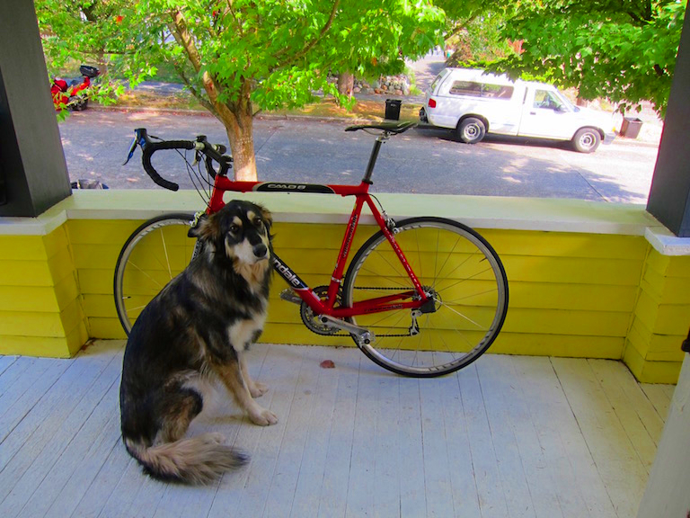

## 9. Super extra credit ##

Implement RGB to [Hue, Chroma, Lightness](https://en.wikipedia.org/wiki/CIELUV#Cylindrical_representation_.28CIELCH.29), a perceptually more accurate version of Hue, Saturation, Value. Note, this will involve gamma decompression, converting to CIEXYZ, converting to CIELUV, converting to HCL, and the reverse transformations. The upside is a similar colorspace to HSV but with better perceptual properties!

## Turn it in ##

Submit one file:

    src/hw1/process_image.py

[1]: https://en.wikipedia.org/wiki/SRGB#The_sRGB_transfer_function_("gamma")
[2]: https://en.wikipedia.org/wiki/Luma_(video)
